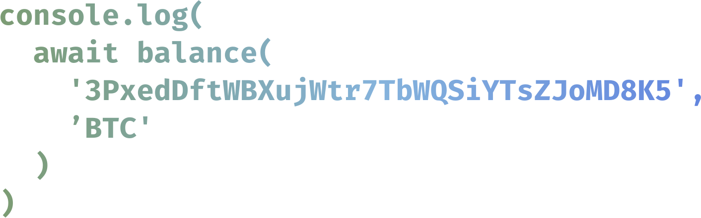

# balance-crypto

Get wallet balance for 300+ cryptos with a unified interface.

### Comparison to [crypto-balances-2](https://github.com/danielheyman/crypto-balances):

- 🔐 optional API keys support
- 💙 written in TypeScript
- ⚡ uses `node-fetch` instead of deprecated `request`
- 📦 smaller library size

## Install

```sh
# pnpm
pnpm i balance-crypto
# yarn
yarn add balance-crypto
# npm
npm i balance-crypto
```

## Example

```ts
import { balance } from 'balance-crypto'

balance('3PxedDftWBXujWtr7TbWQSiYTsZJoMD8K5', 'BTC', 'OPTIONAL_API_KEY').then((res) => console.log(res))
```

Result:

```json
{ "balance": 0, "asset": "BTC" }
```

## API

### `balance(addr, coin, key, verbose)`

#### Options

- **addr** - wallet address
- **coin** - asset token
- **key** - optional API key
- **verbose** - enable verbose logging

## Supported cryptos

| Asset                     | Service                                                           | Optional API key |
| ------------------------- | ----------------------------------------------------------------- | ---------------- |
| ETH                       | https://ethplorer.io                                              | ✔️               |
| ERC20 Tokens (except ETH) | https://tokenbalance.com                                          |                  |
| BTC, DASH, LTC, DOGE      | https://blockcypher.com                                           | ✔️               |
| BTC-based tokens          | https://chainz.cryptoid.info                                      |                  |
| USDC, NGNT                | [stablecoin-api](https://github.com/talentlessguy/stablecoin-api) |                  |
